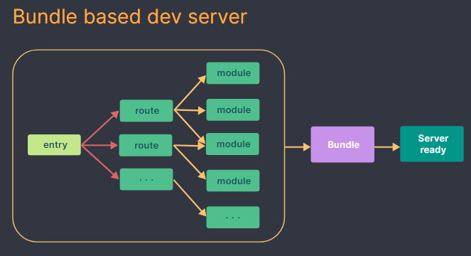
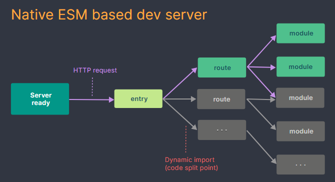

# Vite & Pnpm & Material UI (MUI)

## [Vite](https://vitejs.dev/)

## Bundle with webpack(creat-react-app)


## Bundle with vite(pnpm create vite)

- Vite native model yapisiyla birlikte developpment kisminda hepsini bundle olusturmuyor buda zaman kazandiriyor

## [Pnpm](https://pnpm.io/installation)

## Pnpm vite ile react proje ayaga kaldirma
- pnpm yüklü degilse yükle==> npm install -g pnpm ==>https://pnpm.io/installation
Sonra 


0. Yeni bir klasör oluştur
1. cd projename  ile Terminal üzerinden oluşturulan klasörün içine gir.
2. pnpm create vite
3. Project name: ...  (project1 gibi bir proje ismini yazın)(yada actiginiz dosya adi ile baslatmak isterseniz pnpm create vite .)
4. Package name: react (ok isaretini yukari yön tusu ile react'in önüne getirin   enter a basın)
4. Select a framework: » react (zaten secili enter'a basin)
5. Select a variant: » javascript
6. cd project1 (klasöre gir)
7. pnpm install
8. pnpm run dev yada sadece pnpm dev

## Port degistirmek istersek 
 - package.jsonda script altinda vite nin yanina 
 --port 8080 yaziyoruz

```jsx
  "scripts": {
    "dev": "vite --port 8080",
    "build": "vite build",
    "lint": "eslint . --ext js,jsx --report-unused-disable-directives --max-warnings 0",
    "preview": "vite preview"
     },
```


## [MUI](https://mui.com/material-ui/)
## Default installation

- pnpm add @mui/material @emotion/react @emotion/styled
- pnpm add @fontsource/roboto
- pnpm add @mui/icons-material

## Theme

```jsx
import Typo from "./components/Typo";
import { createTheme, ThemeProvider } from "@mui/material";
import { deepOrange, deepPurple, lime } from "@mui/material/colors";
import TextFieldComp from "./components/TextFieldComp";
import CardComp from "./components/CardComp";
import AppbarComp from "./components/AppbarComp";

function App() {
    const theme = createTheme({
        palette: {
            primary: {
                main: "#bede",
            },
            secondary: {
                main: deepPurple[500],
            },
            error: {
                main: lime["A400"],
            },
            koyuMor: {
                main: deepPurple[500],
                light: deepPurple[300],
                dark: deepPurple[800],
                contrastText: "white",
            },
        },
    });
    return (
        <>
            <ThemeProvider theme={theme}>
                <AppbarComp/>
                <Typo />
                <TextFieldComp />
                <CardComp/>
            </ThemeProvider>
        </>
    );
}

export default App;

```